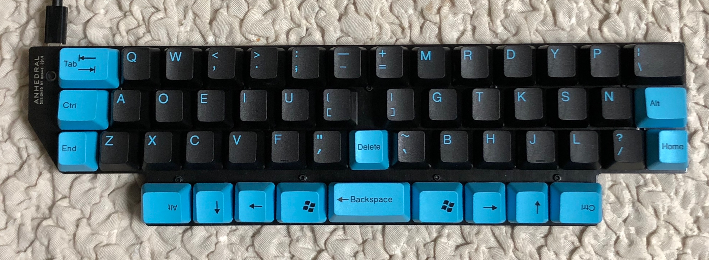

# 自作キーボード　ANHEDRAL rev. 1

## 特徴
- 一体型、非分割キーボード
- 完全左右対称、row staggeredなSemiErgoキーレイアウト
- 親指シフト対応
  - 親指で押すキーが多いので、専用の親指シフトキーを配置可能
  - QMKでの親指シフト入力が可能(補助ソフトのインストールが不要)
  - modifier行を0.25U下げることで同時押しを容易に
- Cherry MXまたは互換キースイッチ専用
- 104キーキャップ対応



## キーマップの例

eucalyn配列、親指のシフトキーを親指シフトのための親指キーとして使う。
```
//+-------+-------+-------+-------+-------+-------+-------+       +-------+-------+-------+-------+-------+-------+-------+
    KC_TAB,   KC_Q,   KC_W,KC_COMM, KC_DOT,KC_SCLN,KC_MINS,         KC_EQL,   KC_M,   KC_R,   KC_D,   KC_Y,   KC_P,KC_BSLS, \
//+-------+-------+-------+-------+-------+-------+-------+       +-------+-------+-------+-------+-------+-------+-------+
   KC_LCTL,   KC_A,   KC_O,   KC_E,   KC_I,   KC_U,KC_LBRC,        KC_RBRC,   KC_G,   KC_T,   KC_K,   KC_S,   KC_N,KC_RCMD, \
//+-------+-------+-------+-------+-------+-------+-------+-------+-------+-------+-------+-------+-------+-------+-------+
   SFT_ESC,   KC_Z,   KC_X,   KC_C,   KC_V,   KC_F, KC_GRV,KC_BSPC,KC_QUOT,   KC_B,   KC_H,   KC_J,   KC_L,KC_SLSH,KC_RALT, \
//+-------+-------+-------+-------+-------+-------+-------+-------+-------+-------+-------+-------+-------+-------+-------+
                              EISU,  LOWER,KC_LSFT, KC_SPC, KC_DEL, KC_ENT,KC_RSFT,  RAISE,   KANA \
//                        +-------+-------+-------+-------+-------+-------+-------+-------+-------+
```

## BOM 部品リスト
- トッププレート(PCB 1.6mm) 1個
- ボトムプレート(PCB 1.6mm) 1個
- ミドルプレート(PCB 1.6mm) 1個
- ねじ M2 x 4mm 22個
- スペーサ M2 x 7mm 11個
- Pro Micro 1個
- キースイッチ 52個
- キーキャップ 
- 2Uスタビライザー (PCBマウント) 1個
- 表面実装用タクトスイッチ TSHA-T-2.5B2-19E 1個
- ダイオード1N4148(スルーホールまたは表面実装) 52個
- PCBソケット　52個

## ファームウェア


## 既知の不具合
- ボトムプレートに固定用の穴が一つ足りない
- リセット用のタクトスイッチがトッププレートと干渉するため予定していたスルーホールのスイッチではなく、高さの低い表面実装のタクトスイッチを使用
- トッププレートが小さく、modifier行の左右の端の1.5Uのキーが少しはみ出す

## 改善したい点
- Pro Microが下側で露出するのは危険なので、ボトムプレートでカバーしたい
- ノートPCの前に置くとケーブルが邪魔なので、横向きにだす
- 親指で押すキーの配置を見直す

